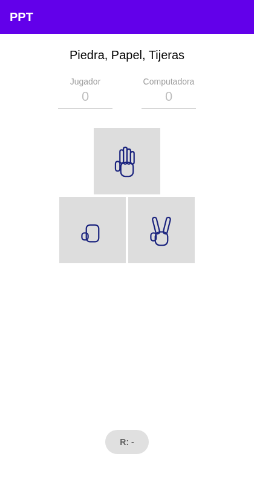
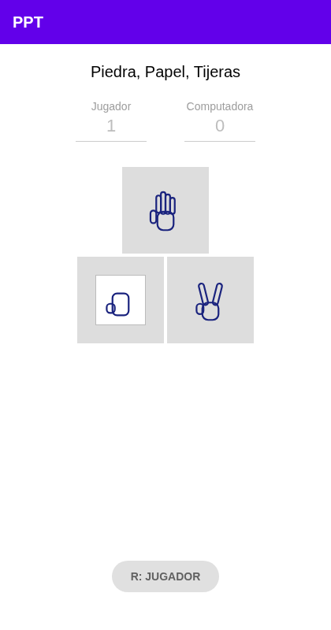
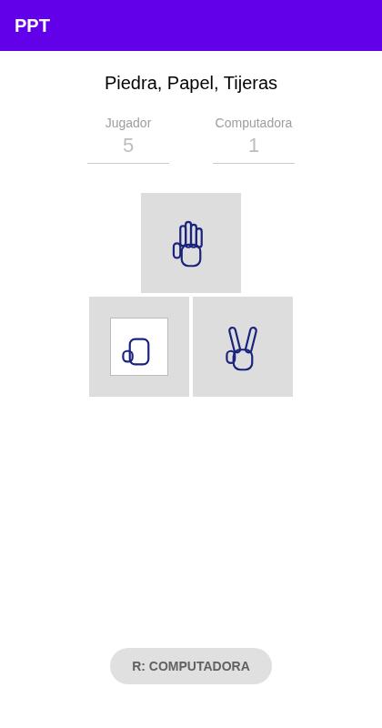
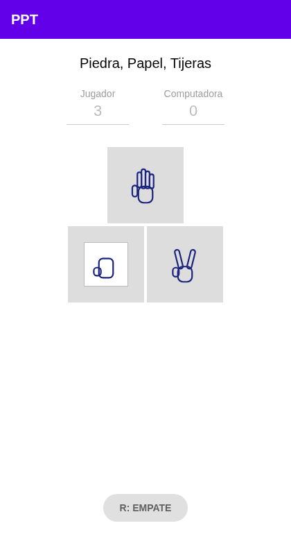
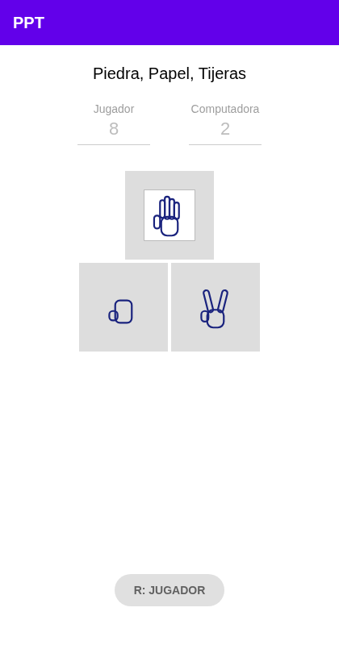
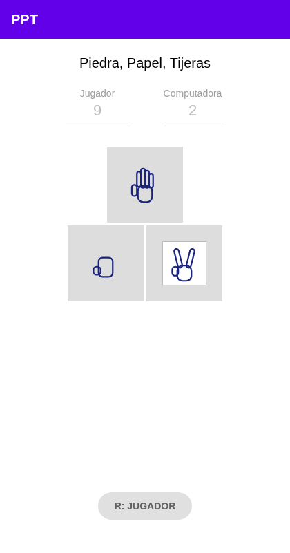

## **Tipos de pruebas de software**

### **1\. Pruebas unitarias**

Verifican la **unidad más pequeña de código** de forma aislada del resto del sistema. Las dependencias externas (base de datos, APIs, otros servicios) se reemplazan con *mocks* o *stubs*.

**Para qué sirven:** detectar errores temprano, justo donde se originan, y facilitar el *refactoring* sin miedo a romper algo.
**Quién las hace:** normalmente el propio desarrollador.
**Características:** rápidas, numerosas y baratas de ejecutar.
**Ejemplo:** probar que calcularDescuento(100, 10\) devuelve 90\. En Java se hacen con **JUnit**, y **Mockito** simula las dependencias.

### **2\. Pruebas de integración**

Verifican que **varios módulos o componentes funcionen correctamente juntos**. Buscan fallos en la comunicación entre ellos: formatos de datos, contratos de API o configuración.

**Para qué sirven:** una clase puede pasar sus pruebas unitarias y aun así fallar al conectarse con otra, por ejemplo por un mapeo incorrecto a la base de datos.
**Enfoques comunes:**

* *Big bang*: se integra todo de una vez.
* *Incremental*: se integra por partes, ya sea *top-down* (de arriba abajo) o *bottom-up* (de abajo arriba).

**Ejemplo:** probar que un Service guarda y recupera datos correctamente a través de su Repository en una base de datos real o de prueba. En Spring se usan @SpringBootTest o @DataJpaTest, a menudo con **Testcontainers**.

### **3\. Pruebas de sistema**

Evalúan el **sistema completo e integrado** contra los requisitos especificados, en un entorno lo más parecido posible a producción. Son pruebas de **caja negra**: no importa el código interno, solo el comportamiento observable.

**Para qué sirven:** confirmar que el producto terminado cumple lo que se pidió, de extremo a extremo.

**Qué incluyen:**

* Pruebas **funcionales**: si hace lo que debe.
* Pruebas **no funcionales**: rendimiento, seguridad, usabilidad, carga.

**Ejemplo:** un usuario crea una solicitud en la app, la solicitud pasa por aprobación y llega la notificación. Todo el flujo se prueba de principio a fin.

### **4\. Pruebas de regresión**

Consisten en **volver a ejecutar pruebas ya existentes** después de un cambio (nueva funcionalidad, corrección de un bug, actualización de una dependencia). El objetivo es asegurar que lo que antes funcionaba **siga funcionando**.
**Para qué sirven:** evitar que un arreglo en un lado rompa algo en otro, lo que se conoce como "regresión".
**Característica clave:** no es un nivel de prueba, sino un **propósito**. Se pueden hacer regresiones con pruebas unitarias, de integración o de sistema.
**Ejemplo:** después de modificar la lógica de cálculo de pagos, se vuelve a correr toda la suite de pruebas para confirmar que los reportes existentes no cambiaron.

### **5\. Pruebas automatizadas**

Son pruebas ejecutadas por **herramientas o scripts**, sin intervención manual. Comparan automáticamente el resultado obtenido contra el esperado.

**Para qué sirven:** permiten repetir miles de pruebas en minutos. Eso hace viables las pruebas de regresión frecuentes y la integración continua (**CI/CD**), donde las pruebas corren en cada commit o pull request.
**Ventajas:** rapidez, repetibilidad, menos error humano.
**Desventajas:** costo inicial de escribirlas y de mantenerlas cuando cambia el sistema.

**Herramientas comunes:**

JUnit/Mockito para pruebas unitarias, Selenium, Cypress o Playwright para interfaces web, Postman o REST Assured para APIs, GitHub Actions o Jenkins para ejecutarlas en CI.

### **6\. Pruebas bajo condiciones frontera (análisis de valores límite)**

Técnica de diseño de casos de prueba que se enfoca en los **límites de los rangos válidos de entrada**. Se basa en que los errores suelen concentrarse justo en los bordes, como un \< que debió ser \<=.

**Para qué sirven:** detectar errores de "uno de más o uno de menos" (*off-by-one*) con pocos casos de prueba bien elegidos.
**Cómo se aplica:** se prueba el valor mínimo y el máximo, justo por debajo y justo por encima de cada uno, y un valor normal.
**Ejemplo:** un campo acepta edades de 18 a 65\. Se prueban **17, 18, 19, 64, 65 y 66**. Se espera que 17 y 66 se rechacen y que el resto se acepte.
**Otros límites comunes:** listas vacías, cadenas vacías o de longitud máxima, null, cero, números negativos y el valor máximo de un tipo (Integer.MAX\_VALUE)

### **Herramientas para pruebas unitarias**

| Nombre | Tipo de prueba | Licencia | Plataforma / lenguajes | Particularidades |
| :---- | :---- | :---- | :---- | :---- |
| **JUnit 5** | Unitarias | Open source (EPL 2.0) | Java y lenguajes JVM (Kotlin, Groovy) | Estándar de facto en Java. Anotaciones como `@Test` y `@BeforeEach`, pruebas parametrizadas (útiles para valores frontera) e integración nativa con Maven, Gradle, IntelliJ y Spring Boot. Se complementa con **Mockito** para simular dependencias. |
| **Jest** | Unitarias | Open source (MIT) | JavaScript / TypeScript (Node.js, React) | Creada por Meta. Incluye en una sola herramienta el *runner*, las aserciones, los mocks y la cobertura. Permite *snapshot testing* para interfaces. |
| **Diffblue Cover** | Unitarias (generación automática) | Comercial (con Community Edition gratuita y limitada) | Java y Kotlin; plugin para IntelliJ y CI | **Genera** pruebas JUnit automáticamente con IA (aprendizaje por refuerzo sobre el bytecode) y las mantiene al cambiar el código. Enfocada en código legado con poca cobertura. |

### **Herramientas para pruebas de integración**

| Nombre | Tipo de prueba | Licencia | Plataforma / lenguajes | Particularidades |
| :---- | :---- | :---- | :---- | :---- |
| **Testcontainers** | Integración | Open source (MIT) | Java, Go, .NET, Node.js, Python, entre otros; requiere Docker | Levanta dependencias **reales** en contenedores desechables (PostgreSQL, MySQL, Kafka, Redis) durante la prueba y los elimina al terminar. Evita usar bases de datos simuladas que se comportan distinto a producción. Se usa mucho junto con Spring Boot Test. |
| **REST Assured** | Integración (APIs REST) | Open source (Apache 2.0) | Java | Lenguaje fluido tipo `given().when().then()` para hacer peticiones HTTP y validar código de estado, cabeceras y cuerpo JSON/XML. |
| **Postman** | Integración (APIs) | Comercial (con plan gratuito); su CLI Newman es open source (Apache 2.0) | Windows, macOS, Linux y web; scripts en JavaScript | Interfaz gráfica para crear colecciones de peticiones con validaciones. Con Newman esas colecciones se ejecutan desde la terminal, lo que permite correrlas en CI. |

### **Herramientas para pruebas de sistema**

| Nombre | Tipo de prueba | Licencia | Plataforma / lenguajes | Particularidades |
| :---- | :---- | :---- | :---- | :---- |
| **Selenium WebDriver** | Sistema / E2E (web) | Open source (Apache 2.0) | Java, Python, C\#, JavaScript, Ruby; Chrome, Firefox, Edge, Safari | Estándar histórico para automatizar navegadores; su protocolo WebDriver es estándar del W3C. **Selenium Grid** ejecuta pruebas en paralelo en varias máquinas y navegadores. Requiere más código propio que las alternativas modernas. |
| **Playwright** | Sistema / E2E (web) | Open source (Apache 2.0) | JavaScript/TypeScript, Python, Java, .NET; Chromium, Firefox y WebKit | Desarrollada por Microsoft. Espera automáticamente a que los elementos estén listos, lo que reduce pruebas inestables (*flaky*). Incluye grabador de pruebas, trazas visuales y ejecución en paralelo. |
| **OpenText Functional Testing** (antes UFT One / QTP) | Sistema / funcional y regresión | Comercial | Windows; scripts en VBScript | Herramienta empresarial con soporte para más de 200 tecnologías (web, escritorio, móvil, SAP, Salesforce, mainframe). Reconocimiento de objetos asistido por IA. Licencias costosas. |

## 2.1 Comentarios del equipo sobre las pruebas documentadas

**Pruebas unitarias.** Son la base de la pirámide de pruebas: al aislar cada función o clase, un error queda ubicado exactamente en la línea que lo produce, sin tener que revisar todo el sistema. En nuestra app las usamos para los `Value Objects` (`Choice`, `RoundResult`) y el `GameManager`: cada uno se prueba solo, sin levantar la interfaz.

**Pruebas de integración.** Nos parecen el nivel donde más "sorpresas" aparecen, porque las piezas por separado funcionan pero la conexión entre ellas puede fallar (formatos, contratos, estado compartido). En nuestro caso el `hook` `useGame` cumple ese rol: integra el `GameManager` con el estado de React, y por eso lo probamos aparte de las piezas del modelo.

**Pruebas de sistema.** Son las que de verdad validan que "la app funciona" desde el punto de vista de quien la usa, sin mirar el código. Para esta entrega diseñamos y ejecutamos casos de prueba de sistema sobre la app corriendo de verdad (ver punto 2.3), no solo sobre el código aislado.

**Pruebas de regresión.** Nos quedó claro que no es una herramienta ni un nivel, sino un propósito: volver a correr lo que ya probamos para asegurarnos de que un cambio nuevo no rompió algo viejo. Con `npm test` corriendo en segundos, cada vez que tocamos un archivo del modelo repetimos toda la suite antes de dar el cambio por bueno.

**Pruebas automatizadas.** Son las que nos permitieron llegar a esta entrega con evidencia real en poco tiempo: Jest corre las 18 pruebas unitarias en menos de un segundo, y el script de Playwright recorre la app real y genera las capturas de los casos de sistema sin que nadie tenga que hacer clic a mano.

**Pruebas bajo condiciones frontera.** Aplicamos esta idea al diseñar el caso CP-06 (cambiar de elección): el "borde" no es un número sino un estado de UI (¿queda una sola opción resaltada, o pueden quedar dos?), y priorizamos verificar justo esa transición en vez de solo el caso feliz de elegir una vez.

## 2.3 Pruebas unitarias y casos de prueba de sistema — App Piedra, Papel o Tijeras

### Pruebas unitarias

La app (`rockpaperscissor`, Módulo 4) ya cuenta con una suite de pruebas unitarias con Jest (`jest-expo` + `@testing-library/react-native`):

| Archivo | Qué prueba |
| :---- | :---- |
| `src/models/vo/Choice.test.js` | Que `Choice` valide valores inválidos, que `random()` siempre devuelva una opción válida, y las reglas de `beats()`/`equals()`. |
| `src/models/vo/RoundResult.test.js` | Que `RoundResult` resuelva correctamente empate, victoria del jugador y victoria de la computadora. |
| `src/models/managers/GameManager.test.js` | Que `GameManager.play()` sume el punto correcto según quién gana, que el empate no sume puntos, y que el marcador se acumule entre jugadas. |
| `src/hooks/useGame.test.js` | Que el hook arranque en 0-0 sin selección, y que `handleSelect` actualice marcador, elección y texto de resultado. |

Se corren con:

```bash
npm test
npx jest --coverage   # incluye el % de cobertura
```

### Casos de prueba de sistema

A diferencia de las unitarias, estos casos se ejecutaron sobre la app **corriendo de verdad** (build web de Expo servido localmente y automatizado con Playwright headless), no sobre funciones aisladas.

| ID | Descripción | Pasos | Resultado esperado |
| :---- | :---- | :---- | :---- |
| CP-01 | Estado inicial | Abrir la app sin jugar ninguna ronda | Marcador 0-0, ninguna opción resaltada, resultado "R: -" |
| CP-02 | Ronda ganada por el jugador | Elegir una opción hasta que le gane a la de la computadora | Resultado "R: JUGADOR", marcador del jugador +1, el de la computadora sin cambios |
| CP-03 | Ronda ganada por la computadora | Elegir una opción hasta que la computadora le gane | Resultado "R: COMPUTADORA", marcador de la computadora +1, el del jugador sin cambios |
| CP-04 | Empate | Elegir una opción hasta que coincida con la de la computadora | Resultado "R: EMPATE", ningún marcador cambia |
| CP-05 | Acumulación de marcador | Jugar varias rondas seguidas | El marcador refleja la suma correcta de rondas ganadas/perdidas, sin resetearse entre jugadas |
| CP-06 | Cambio de elección (condición frontera) | Elegir "Papel" y luego, sin recargar, elegir "Tijeras" | Solo la opción elegida más recientemente queda visualmente resaltada; nunca quedan dos resaltadas a la vez |

Evidencia (capturas tomadas por `scripts/capture-system-tests.js` sobre la app real, corriendo con `npx expo export --platform web` + `npx serve dist`):

| Caso | Evidencia |
| :---- | :---- |
| CP-01 |  |
| CP-02 |  |
| CP-03 |  |
| CP-04 |  |
| CP-05 |  |
| CP-06 |   |

## 2.4 Reporte de resultados

### Resumen

| Tipo de prueba | Herramienta | Total | Pass | Fail | Cobertura |
| :---- | :---- | :---- | :---- | :---- | :---- |
| Unitarias | Jest + jest-expo | 18 | 18 | 0 | 100% statements / branches / funciones / líneas |
| Sistema (caja negra) | Playwright sobre build web real | 6 casos (CP-01 a CP-06) | 6 | 0 | — (no aplica cobertura de código, es funcional) |

### Salida real de `npx jest --coverage`

```
PASS src/hooks/useGame.test.js
PASS src/models/vo/Choice.test.js
PASS src/models/managers/GameManager.test.js
PASS src/models/vo/RoundResult.test.js

File             | % Stmts | % Branch | % Funcs | % Lines
-----------------|---------|----------|---------|---------
All files        |     100 |     100  |    100  |    100
 hooks/useGame.js|     100 |     100  |    100  |    100
 models/managers/GameManager.js | 100 | 100 | 100 | 100
 models/vo/Choice.js       | 100 | 100 | 100 | 100
 models/vo/RoundResult.js  | 100 | 100 | 100 | 100

Test Suites: 4 passed, 4 total
Tests:       18 passed, 18 total
Snapshots:   0 total
```

### Resultados de los casos de prueba de sistema

| Caso | Resultado obtenido | Estado |
| :---- | :---- | :---- |
| CP-01 | Marcador 0-0, resultado "R: -" | Pass |
| CP-02 | Se registró en la ronda 1: `{ player: 1, computer: 0, result: 'R: JUGADOR' }` | Pass |
| CP-03 | Se registró en la ronda 13: `{ player: 5, computer: 1, result: 'R: COMPUTADORA' }` | Pass |
| CP-04 | Se registró en la ronda 4: `{ player: 3, computer: 0, result: 'R: EMPATE' }` | Pass |
| CP-05 | Tras 18 rondas: `{ player: 7, computer: 2 }`, marcador acumulado sin inconsistencias | Pass |
| CP-06 | La captura muestra el recuadro de selección solo sobre "Tijeras" tras elegirla, habiendo elegido antes "Papel" | Pass |

### Conclusión

Las 18 pruebas unitarias y los 6 casos de prueba de sistema pasaron sin fallos, con 100% de cobertura en el código del modelo y el hook. Al ser la jugada de la computadora aleatoria, los tres resultados posibles (jugador, computadora, empate) no ocurren en una ronda fija; por eso el script de automatización juega repetidamente hasta observar cada uno, en vez de asumir un resultado específico en una ronda puntual.

## 2.5 Guion de la presentación y demo

1. **Introducción (1 min):** qué app se construyó (Piedra, Papel o Tijeras, Módulo 4) y qué se pidió en esta actividad de pruebas de software.
2. **Repaso de la investigación (2 min):** recorrer brevemente los 6 tipos de prueba documentados (actividad previa) y las tablas de herramientas investigadas (2.2), destacando cuál de esas herramientas se terminó usando (Jest para unitarias, Playwright para sistema).
3. **Demo en vivo — pruebas unitarias (2 min):** correr `npm test -- --coverage` en la terminal y mostrar las 18 pruebas en verde y el 100% de cobertura.
4. **Demo en vivo — casos de prueba de sistema (3 min):** correr la app (`npx expo start --web` o Expo Go) y repetir en vivo los casos CP-01 a CP-06 mostrando marcador, resultado y el resaltado de la opción elegida; opcionalmente correr `node scripts/capture-system-tests.js` para mostrar cómo se generaron las capturas del reporte.
5. **Cierre (1 min):** conclusiones — qué aportó cada tipo de prueba, qué se automatizó y qué quedaría como siguiente paso (por ejemplo, pruebas de integración si se agrega un backend).

[image1]: <data:image/png;base64,iVBORw0KGgoAAAANSUhEUgAAAZ0AAABrCAYAAACsY18SAAAdK0lEQVR4Xu2debQ0R1nGX1FkDbuKCMaDSxAxrAoBQgAxLiBGQJEtfgKKIEI8orIewiJ4gIhH4RggEIQcUAmyiCAiEECQXWRTCPJ9Asq+CMgq6Lzf3Ppu9a+2t3qbnjv1O+f543Y9T1X19Nzpme7qKpHt5fYrPXOl96/0fxEdWelPV7rT2t5oNBqNRpmzJDyhjKFzpdFoNBo7z/kSniCs+t/INqteK41Go9HYCZ4u4Umgj5SzI9tr9Q/SaDQajQPF8RJ+2A+V4/GRsr46WRqNRqOxtdxZwg/2seTzDZQN1SOl0Wg0GlvDj0j4QT62CMtTemNkW0p3kEaj0WgsGn5wT6EvSMhDJfTF9D17fm7PqdFoNBoLgx/UUyoFfTH5sKykRqPRaGyYH5Xww3lqpaAvJh+WWXTXo8lGYzu4mKxHaPK932hsJWPfwLcoxzkS+n1dft96lIt4ZbVqNJbG8Su9XsL36pTv2YuudFtZzwjyyyhrNEaFb+g59HzJ83IJM04Xej4f+mq0JNi3udRYBjwuMY0J61Zdt+NoNEaEb7Y5dIGUYcZXCvpq9W2yDNivudRYDqVHFMbiuySs+2sdx/JgfxtbwmUlPHhzyQIzTnoZLQW9fXQD2Tzsk6+3rPTilZ7jiR4n3/PXK/1zxOOrsTx4jMY+Vqx3zLqngH3dhj43VnxEwoM2lyzoMGrmVP/omyLQ31c6F9wmYX9K0N8311gePEZjH6up6p2C3CX3xoI5QcIDNpesMGfN0z9Ep8vm8PthgX3vm20sDx7TsY+VX+dVULY0virh6zD269EYmStIeLDmkpXUOjsWmBmqm8r8+MfoTShLwX47WfBHLTaWB4/pmMfKr+8zKFsiJ0r4Ooz5ejQmgAdqLllJDXu28D4Jc2NIn42YEx2q6tq2wj73zTeWB4/pmMdq7Prm4J8kfC1+oeNoLAYeqLlUA7MqfXbAAnNPjWzrqznxl4uwwv72zTeWB4/pWMfqUjJeXXOjo0y1319nQWM58A07l2pgVnWZjiPNqyTMKtw2RHNxWNbtvZ0FGdjX2j7X+hvzwWM61rFy9VyLBY3GUPhmnUs1MKs6ruPIw+y1E9uHaqmwn0vvb8MOj2k7to1Fc0MJ36xTS29M18C8qgZmL/DK3hspH6IzZZmwn06N7YfHtB3bxqLhG3Vq6ZDGGphX1cAs83rpgOVDtUTYxyn6+mcrvXulP5Fw3ruxuKes5xvTSS3vi7IadA2oK3Ojx9NWesNKd2PBSBxa6ZUrvXqlh3SLquExHevYniLrh4z1YWNdKv7i3eLROCTrL4KqM1f6lv2i0fhpbhjAabI+di+RcR6buI6sp/x6x0rPk82MiJ0Nvkmn1ufFzq0kzKtqYDaVp2cMLQ32b6x+6o1a1umr9ktGDNYZ048fc8eJDaXlSUf/8enxNQQd7ML6Urr+XsYK80P6yzpSOs8FeqKfBawzJn/aqWvKepXfd3rl7/HKfX5A1g9w+3UNgf2KqeZy/zMlzMf0b3v+A8HcM0Z/TOzcRsK8qgZmValRbvTFdGtZf/vl9pyWBPs2tI/6Dc+vR6fP0W+TrH9IO6yjJP2gcTwqUk75Jx2WpdQH1qE6aa/scZGy2raYq80rsS8PD9wr0xV1WeZ0pT2PlS9JWIf+YnCwrCQHt8fUB9ZR0kvXsSQ3kTDz53tlN17pm5Fylc7svfVwp6bUv4ud1Bu8BmZVuWnY6Y3Jwe05TXGZoC/sm1MfSnXoiEJ6Yr4UzHEuPZbH2rCedJ4V2V6SlUtImNUvLzHoc7Jc0mKmtp/MpbJPltCnch+aJZhTxS573UdCX0z+yFWWxVSD/sLIZT8tYf0pr4O+Wu9HO44tgzszpfQbsBVdMI15VQ3Mql7WcXT5Pgn9lA/LSloK7Fff/lnz15PQm/M7avz0uqXJCX0xEZb7up3nS/GtEuZKMzPT71SCfmtOYaaU+7KEfpWeKHLEfuHk2qLP9+qs11f0/va5o4Q55kv4mdpj9sJu8THos/SHfmtucdRcWx6qV4udX5Mwr6qBWdV/dBwhH5Iw48tdYnCwvCS9SbgE2C+nGpgt5elV6YdxCnotvFHW3tyHA+u1tkGvNafQb8kozFiy9FoyCv0qnVm+BDOW9uhVPaLj6DLkni4zQ7IWvihrrw4EiME6rXXT7/Q237QNcAemUur+SYz7S5hP3SBMwbzqvzuOOMxQhOUWLQH2qbZvsWvRJejP5egpzRZew8clrF/FgQQxmMntg4NeS8bBjFPqA02h19LeWRL6SxnHVSXM5fIfkNCX8vrQb8koqV9jJegfY2Ta1SWsV2Vdl4s5674sCnZ+CtXcy3iwhPnaDxzmVdYRQMz5ivFWCX0lHX80uVnYJycrzFmy9Kdy+qBuyTOE1LNYU5x09Ns7vSpd3tnCKyTMltqkr+RX6LVkfJjL5enJeX3oV/12xxHnwxLmSu39sdT5rbDO2rqZc9KlXbYCdnwK1fAYCfMv6jjKMK/SZzAsMGfZj9S3qJI2DftT0y8dFcacJUt/KsfymGcI+quZ9aumOOnQV/LHYNYpNVKMvlKbqeNpnbFcYdYpdnWBHqcS9Kv0+ZgSqUvmOegt+a2wztq6metTx0Zhp8fWA8TOEyXMq2pgVlUzUo5ZSx/otWrTsD81/WJmqAjLY54hHJSTTuqSM32lNvX+F72q3/RNBZjNtcvylI/Qr3pSxxGn9qSjJ3N6c34r+rA066ytm6Po+tSxMR4mYafH1K+KndTszjUwq5pjAkz6rXqzhjcI++NkgZm+iq22Ght6Ova6LQflpJOqh56cV6HPyX/OqYSOCGU+1S7LUz5Cvyo3EMVRe9Khr+S3wvr61P1TEmZr69gY7PCYsgwhdTxXwryqBmZVOi2KFWZr+sBMjTYJ+1LTJ2ZUf7vS1XxTT1iv6pMdx3DmOuno0/L05fwpmC3VQ0/Oq9DnlBqGHCP1PF2s3dgXC5Xea8tBf6zuGAfppKMw63Rn37RE2OGx9JNiR588Zj727TcH86q/6DjyfEXCvMpC7ueyRZuEfanpEzOq1KWeWlhvTb+szHXS0Xsi9OX8KZgt1UNPzqvQ53RL31RAn5Vh3ik2MosepxQ6xx69OgrRwq6cdGpuZ8yOTpDIDo+hk8XOayTM6035GphXWUcFKXq/h3mVFeZqVXuCHRP2xckCMzXZEqxzzLodc510Dkvoy/lT6OVF5nP10JPzKvQ5WUaGOWIPv+baPSyhL9cmfal6Y+zKSedU37Q02NkxVIPea2G+NEEjYV5VMzvvYQnzNftxoYTZPtoU7EdNf5ipyZZgnWPW7ZjrpOOv6ErVLGkemwct1y49Oa9Cn9NnfVOBy0mYL7Wb2i8uJc3yXJ0xduWks2jY2aGqIfZhfULHUYb52j78p4T52jqY7atNwX7U9IeZmmwJ1umUm2GglrlOOjpPGn1OOnjGCrNOutRCDPqcUtBnyZDYw8KWOmLPZOV0zjpWxVgnnb/yTT1gfZa+xGC2Tx2zkhqT31dXETs6szTzqfmxUjCvqiF1E7MGZofoDNkM7IeTBWacdEbcobDO2r5ZmOuko9BnyRDmSnn6+vpzGfIECbOqF/imDMz50uUwan4ZkrFOOrmMhdg97Np6a2d/WASpqbL7KDcVB2FWdYWOI4+OiGNeVYObE4mqgdkxtAnYh5q+MFObz3EXCescs36lnXRC6LVkfJiz5nW2Eau3L7Unndj9ZkvOAutysg7EOVfCrMpfDmJxsLNDZIU51SU7jjypqc1rYHbMOoZqE7APNX3R0UjM1dahpEYfsT7KSso75zQ4+j6n18k6PRRzqsd2HF3odcpBr5P1eTLm+rQ5FX2mwaHXl16et+Aur/qwLmt/HMzUZDcGO9tXVpirySqPlzBfWwezY9YxhjYB+1DbF+aon9m3Bny77Pv0WyjJXYZwyuGPSoyR+hDSyRhLMJNrx6FLDtNvySlHJMyUcvRaMnoCpN+SczCTy9HnVHPlpIb/kbCtXP+U1KMU1rw/ywNhPU46GKMEM6qaEbsbgR3uKwvMWHOO8yXM19bBrKpmqPJFJMy7PnBbX83NgyTsg1PNA4HMpqSLTX0qsl2Vgr6cDke2qVLQ53TI86RgptSWg36n0j1N+oe0VeJdEmYs2adI6D+l4+hCbx89XOww61SC/pxiA6RUscdIdFg4fU45dA5J+kuZjTPW2jkWmFFZpqxwxIZVW9t2MKuqeRYo9Xq566/c3lenybywfcrKPSTM1qgE/TXK3Xim11cJ+p3+3jclYMbpTr7JI3YPUr8E5Ui9Z1X6C69E6leBLroW42YSenUexRypNvqqtOYP/U5HPE8KZmqU41US+ks5+o50ShdKbBbnPiqhvyRqMz467QnztXUwq/pcx5Hn0hLm2Q9u76t3ynTkLptYlUOfr6K/pNgltRTMWkR0AscXS+hL6eXr2DF+3SsrSZe6yJGaXFPlwzKW++gxzk0ESenMz6mHMJXc9D3HeT6th+WX98pzMDdUPytddHZ6enL6g3UsCr0WWdDlVphz+iHPd/dIuS5qtxWMMXLthpLnphJmakapfUPCvKoGZlU/3HHk0RvKzMf6wbIhmoqpTzqO3JQvtXWRa0pYT0znuQC4kYTeknws1/dT2RTM5PRze5kUudkAciqhQ5WZSUm/udfCOobKh2UW5UhdZqfu6wIV1Fwx0EvVWwV3oI9K0G/JOJ4lYbYmrzCrqlneQGE+1Q+WD9FBIXVfYIxvZqlnzF7nm7YIHVCRW4/pO/etG+VREvbN6Vc8Xx9Y3xB9r0xPatnsMSal/Q0J63XSqcu2Eu5IH+WIzelmhbnavMKsqnZEDPO5ftAzRI3GruL/H+jjETH011xqYFH7P1owPEB9lMIfBuv06I4jDXOltmIwq9KHvGpgXqXzQ6Wgd4gajV3jb6Tf/8ClJPz/qa2jMRM8QH2Ugr6c14eZmqyDWVXNMtf3ljCv+oRvikD/EDUau8TQ939s1FyfehoTwwPURynoK938VJgptRGDWdUzOo48fyhhXmV5EpuZIWo0dgW+92/dLTbDeh7cLW4sAR6kPorxCrH5fD4oYcaS82FW9biOI8+zJcyrLCet3BonfdRo7AJ83w95749VT2NCeJD6KAY9KZ9Dh13Tr0Ola2Be9bsdRx59mI951b18UwbmhqrR2AX4vldZrorEYD2NBcKD1Ecx6LlGtziA/lS9KZitzb9FwrzqJN+UIfXw6hA1GrsA3/d93/8XyLB8YyZ4oPsoNjs0PTnoLfkJs7X590uYV9WsC8TsGGo0dgG+7510ahwrfBhWZz1vLBQe6L4ipXLH8yX06gN/FlJT+NRQu65GDGbHUqOxK/C9X/N/wM+QxsI5W8KD3EekVK7o08L0pbzktyTMWbMOZsesY6is63NsitoZHRqNHDrzMv8HYvqApCf+rb0H3NgQx0t48ProsHRheQx6Uj6i94eYs2YdzI5ZxxjqM1/TVNxPwv6pGo2x4XvMqsaWwQPYVz65MuU6Enqsa9owp7LOZKswm+pjDmbH1iZhX1JqNKYgN7murxe4QGP74MEcIkdqu4PlMU8MZlQv7DjyMFvTtoPZKbRJ2JeUtgX2O6epYDspNRo7Ad/4Q3S6rOH2j+9td7BcVYJ+a87BXG1eYXYqLYXfl7BvS+tjCfY7pylgGzk1GjsB3/hDpcQWc3LoOjYsK60smFoDRicVtRBbcdHvkwVmp9SSYN+W2EcLsQeQqSnupbEN6gn71kZjNzhLwn+EoYotcOTgdr8sBf2qh3ccaVIrBtbA7JTS54aWBPvntK28W8J9mWq/cuuhjN1Wo7FV8J9hKinc5raniM3jVso4ri5hTnWGbyrA7NRaGuzfUvtZA/fF12U831BYN9Xo0l6XHYL/DFMptcpeDnpVludETpEwZ2nPh7k5tDTYv6X2swbuCzUGuson6/VlHa25K4z9+jcWDv8h5lRu9FlqihoLzDjp/aESF5MwN5eWBvu31H7WwH2hxsDVFbuHqdL7ng2REyV8bRo7wCY/ZG8gaeh1KkF/TVbnbWJmLp0qy4N9dNpm/H3gfo21f3O0se18TsLXpL0uOwQP/FxKTc5Hn68cqUXYVL/o+VIwM6eWCPu45L5a8feB++V0rb3yPrg6zsff1K7D16O9LjvGNyU8+HNIR7rFoM9XDnqtOYX+ubVE2Mcl99WKvw839/6m+qDPqjHPelm+q/D1aK/LDsKDP4duKXHo85XiqxJ6LTmF3rm1VNjPpffXAveB+8byGmJ51svyXYWvR3tddhAe/Dn0Ogl5ioQ+Xynoo1LQtwltisdK2BeL+vIlCetySn0BGRvuQ+xhZnos6ByAsRzrjHlq4PoxMdUs0x7jybJf18VRpnxCwjZV+hBuDh2SzoxFX9CwgdI92T48R9L5Z0q3fr1iZEEfRHYZDm66mleWajfFyyXMOqWWjaGvpAesY8dgeUpRriqhcQ4RllMxUstNO+k/UYzrSuidW3eX+WEfalVL7oOdmpJbSLwd9iHmKZHKsc6Yx0JuWqKU3H2lHLn7oCr/pHNhpDymFPTVqAT9OcXQAVXnSOhN5ViW8j0EZZR/0nlqpDxWJ6m5PUJYXtKoJx2FxjlEWE7FoIdKDSKgbxOak69I2P53dBzpaYf69tnPfRBlCutWXaLjGA9/Bg4ftu9Us06LyxyX2E7VwGwqT0/OqzxJQi/lTjrcXhJ5uoQeq35P0lxPul5d2M3neV6ZL8LymBw6nyTLYr53RMood9LR1VJZFquT5Hypkckx6KH0R0mOcyXMpNrqoEOYGZpaernAh+XUv+5bj0EPde996zHo2YTOlPlg26ocX5PQb8n5+Bm95xZDP9RYf00bNfjPfvno8uRsP+ZLkfOzvpQvBXOlLL2WzIcl9Dv5v4T0JKz/S7eT/Puj1J5CvzXn4w/cUNWOho1xREKf7y89+BurN3U5UqUnndTzXLk6Fb/8vShzxJaSSdWXuzxnoU/mKAzOIR+WxeSjv2JYTn30mHvNfbyyTWou2K61bWaGZHPQa8n0IVc323b6O9+UIFWnwvpyXsKM6lkdRxxmLG3S60tX7UxB79D2rOgvyposvao+JyluiykGPU6WKwt6hYLQk4Ne1Sc7jn3os9TvqPUfo3QzbgpdWvZhWUyPOOYW+XqkPCYflm1C15R5YLtOFpixZun/crc4IPVNcGxydecuheTwr6fHYF05r0/qPqUFZpyu5JsAvU6lS52xG99OOei1ZHxqc/TncjWXun7C2/4ulPmwDopYy1QXdEpD6E/Vq+jgLvpUr/dNCZxXH/ythg3OIQe3p+Tg9pR8WLYJzQXbVVkntmTO0nf/n9Dp+zuOkN+RMFNqpw+lutm+E0cY+TjPA1mwB+vKte9DvzWn6M1e5kr5T0voVcVGrxFmSm0p9FoyjrOlPkd/LvcvEvqczty3HUNP5nr/JEduMM2hfVuHU7hhD+ZLvFTCTC5HX8mvpC5dV8EGp9Z7ZA2351TjP23Pr9+6WTa3rB/6Q2G7TlaYs+TpLfmVQxJmVHfwPGNQ6hPbL/nvIvlyhfWU/Mr1JfSrdLSlFWadbuSbPPQSNL2qJZ50mLHk6M/l3iahT/UR31RJ6qSe6kMKZi35Z0uYUekw/xj0OeWGxNf0J0nuZ/NU0jHxhyLbU9IhodyWk8Jtc0s/qOaCbav00oEVZp1y0Kt65UpvlPXlh8OSf17H1+1lXPy6Y+gXE/Yh53dln2eBB+vJ1eeg15IhzJbq2ZaTTurRjtes9FZZr5l0JFKeUozUSWcIqZOOdTFKB/OqV630Jln/QtP7b7FRqjFdTuLcRkKvUwpXrgMtBsEG51BpZgFKrzVy25I1F/qtjG2r7u+bCjBb2gd9iI/eIRobS93sQyqj/7Cx7YR1TJUhzJbq2ZaTDv1DlFpiYs6TTu7SLbmJhPkhykFvLvMZyZdXw0ab+mtO2LaTLm5nhdnSftAX03/JenG+h6108jo2G64PucskuW+JPqnthHVMlSHMluo5SCedD630XFkP7z5hHatiqScdZmPSm/gvW+lBK520jvWC9TrlHj/JLVVTDRtuqldqctOpYPtOqWGiMZh1SkFfyT83rj96YzUH+++kI9zoKcE6LDl6LRnCbKmebT7p3LPjGM62nXSmgu2k2kttH8StJWw4p12A+5xTahqeKWEfnGqGajPrlIK+kn9uXH+eyALwBgn3wd8X/p2DeUuOXkuG5KZGibENJx394ka/Su9ljEk76axhO7H23La7Yfso5IYRUnwY86ChDwxyn1PSm+abgP1weppvKsCsUwr6Sv65cf25HwsicB9i+vlj7jTMOOWg15Ihu3TSKeVqaSedNfpZwbZU/mfI1H04Og0GO5DTQST3zxzTpmA/+vSJuVKePqfSMwxzcCvZ788dURaD+xCTBWYsWXqd7uqbCjBbansbTjoK/dZcDe2ksw/b8tt0Q/tLD38Pho2XdJDgvpW0SdiXPv1irpSnz5KZC/8BuduiLEZpehL3XFkJ5iyvB71OfSYgpVLT72/7SWfIaq9kqSed3OwrU8F2/PambrsDO1DSQYD7VNKmeZGEfartHzOl7Nsl9JYyc+H35ZdQloL70Gd/mLPk6bXmfJgr5bf9pGPJWlnqSUdnPmB+jL7lSD0X5b9Gs1G7vkfNqKmlwX3JSYcrLgX2zZcFZixZeq058lBuGIjfD33vWsgtKGiFOWuefqfUMh2EOVXquRRlW046CjNOqV9xtSz1pKMw37d/N+WGDGzH1xU83yzoanTsRE7683CbSP0jpjT2tC1DYf+oEvRbcvRSJfwpYMbE70NpyLQP+1/bL2atddBfk1WYKeU+JaFfdSnflIAZS3v0Op3nmxIwQ5XQhRNz3ndKWGfKa0VnrWB9qtov4/6DmDFded+apHZ/2IavjcGOlPRH69hiuZeEfS5p7udwrLCfVOpNqseIXqcS9Md0pjPvwbU8dEqTMWH7VpirySrMOl3RNyVgxqn0gG9s1m5dAycH/U6W+d6YccqRm3mkRG4Umy//8YDvjpSnoK/kt8C6nHS9m1pYR0yceUT/n/xyXcCvBtav0gXyNgo7ZNWSyD2NntOSmXKpijdLen40emv0RRkX1q+qwc/VPOFeGulogRlLll795l6CGSfLgAlmnHIT2+YWzlM9RtZzgOlqs/o30Xn8mKnRZSUNvU7X9k2VsC6n3CXPFDpfG+upUWwhzBKsQ7UIXithx6x6nGyGMyTsi1Xb8jzSRSXse0kKt6UU45IS+ixKTUJYi37guQ+snPTDrXRd3fdbqLnf+ZdS174vfqjfwitzemTHEaJ1MEPd45g7hF4qNzyd3pxuuZfxya14mlOK2K8hSm8RcLXjEqyD0iHHpfcA+UEJ67HoURrugU4qyroWw5kSdq5GOix08EylBW4u62/TbLtGL5HtQr/ZcR9iOrLnV1hGPUPy/4D6q4CZnFJTrfeBdZeUQ7/tq+d4FgD91sp6a5SDXovufDSZhv6SfFhWUoxTJfTFlCN2KTGn1Ic7fVbloNcqK7nZoGOyDqBJ4dc1+wACC5+VcKf76mMr/Zj04xorXShhnX1V86zEErmvhPvkRPyyG6OsBv12xbZ8TbHcA9soaQymPOk4dJlh5ijrlCTMleTDspJS6L0tekuZGDWrfcag36oc9FpVyzkS1uHrZvvWQQzp46zwBRiiPrCOIWo0Go1dxX0O6vpYi2fojS+nPrCOPtJrvY1Go7HLuM/DrUKv//MDvUZ9YB01GvMeQ6PRaGwr/ufi1nKuhB/yJfWBdZS0FT8dG41GY0bc52Ptw6yLJfW0LtUH1hHTtg8OaDQajakY+hm8eHLPOPSBdTht6rmgRqPR2Bb8B5zfh7IDzenS/yl1fZgrtq53o9FoNNLwi3qj0Wg0GqMTG/ClD+E2Go1GozEqOpciTzjtV06j0Wg0JoEnm3bSaTQajcZkfEnCE45OadZoNBqNxiTwpNNoNBqNxqScKOvh0iexoC//D4bh9Q+tUyP8AAAAAElFTkSuQmCC>
